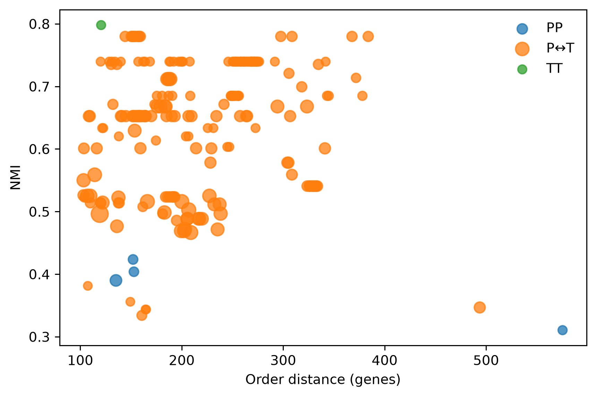
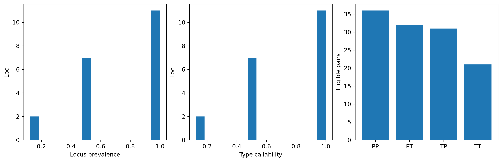
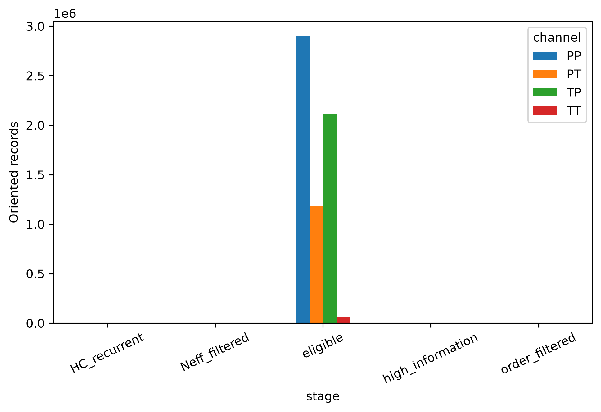
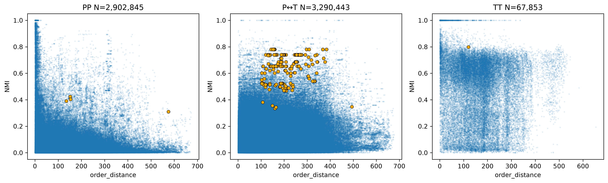

# Cinch

> **Research preview — actively in development.** Cinch reports statistical
> dependencies and network-ready candidates. It does **not** by itself establish
> molecular epistasis, fitness interaction, or causality.

Cinch is an information-theoretic workflow for bacterial whole-genome data. It
represents every locus in two complementary biological state spaces:

- **P** — presence/absence;
- **T** — nominal CDS allele/type state.

The resulting **PP, PT, TP and TT** channels let Cinch recover ordinary
gene-content associations while also detecting allele-type dependencies between
genes that are present in nearly every isolate. Mutual information is reported
in **nats**; allele identifiers are nominal categories, never ordered numbers or
SNP distances.



## What is frozen in this snapshot?

This repository exposes the current development interface:

```text
genome assemblies
  -> locus presence and CDS-type states
  -> raw MI/NMI in PP, PT, TP and TT
  -> gene-order long-range filter
  -> HC background recurrence of the same state-pair driver
  -> order-conditioned Neff filter
  -> network-ready candidate dependencies
```

The filter intentionally stops before ARACNE and network construction. HC is a
cross-background recurrence diagnostic, not a model that creates adjusted
p-values. Gene-order distance is the retained local-linkage axis. The exact
frozen definitions are in the [mathematical specification](docs/MATHEMATICAL_SPECIFICATION.md)
and [freeze report](CINCH_WGS_FILTER_V1_FREEZE_REPORT.md).

## Install

```bash
git clone https://github.com/Naclist/Cinch.git
cd Cinch
python -m venv .venv
source .venv/bin/activate        # Windows: .venv\Scripts\activate
python -m pip install -e ".[test]"
pytest -q
```

Python 3.10 or newer is required. No SNP matrix or phylogenetic tree is required
by the current WGS state builder.

## Quick start

Run the synthetic 48-genome example:

```bash
cinch wgs \
  -r examples/tiny_wgs/input/ref.cds.fasta \
  -p tiny \
  -t 4 \
  --phenotype examples/tiny_wgs/input/phenotype.tsv \
  examples/tiny_wgs/input/genomes/*.fasta

cinch filter --wgs_results tiny.cinch --hc 2 --order-threshold 2
```

The demo contains positive PP/PT/TT examples plus local-linkage and
population-confounded negative controls. Its expected compact outputs and QC
figure are committed under [`examples/tiny_wgs/expected`](examples/tiny_wgs/expected).



For real data:

```bash
cinch wgs -r ref.cds.fasta -p RUN -t 8 genomes/*.fasta
cinch filter --wgs_results RUN.cinch --hc DATASET_HC --order-threshold DISTANCE
```

Both filter thresholds are dataset-specific. Cinch does not silently substitute
a universal HC level or physical-distance cutoff when selection is unresolved.

## Repository map

| Path | Contents |
|---|---|
| [`cinch/frozen_v1`](cinch/frozen_v1) | Current state construction, MI/NMI, hierarchy, order distance, recurrence and Neff code |
| [`docs`](docs) | Input/output contracts, state semantics and mathematical definitions |
| [`examples/tiny_wgs`](examples/tiny_wgs) | Fully redistributable synthetic input, expected output and figure |
| [`examples/spn534`](examples/spn534) | Compact real-data development snapshot, figures, source accessions and checksums |
| [`tests`](tests) | Portable scientific invariants and CLI tests |
| [`FROZEN_CINCH_WGS_V1.yaml`](FROZEN_CINCH_WGS_V1.yaml) | Machine-readable freeze contract |

## SPN534 development case

The real-data example uses the 534-genome *Streptococcus pneumoniae* dataset
published with Coinfinder. The original publication dataset contains 2,813
accessory families and makes its presence/absence matrix, core tree and
Coinfinder outputs public. Cinch additionally resolved versioned assemblies to
audit CDS types and gene order.

The manually frozen development settings are **HC69** (single-linkage allele
difference threshold, not 69 clusters) and **100 genes** for long-range order.
Starting from all eligible pairs, the current filter snapshot retains 223
oriented records: PP 4, PT 58, TP 160 and TT 1. PT and TP remain separate in the
calculation because they encode opposite P/T orientations; they are displayed
together as P↔T where orientation is not the scientific question.





These 223 records are **candidate dependencies**, not validated epistatic
interactions. SPN534 has been used during method development and therefore is
not an unseen validation cohort. See the [full interpretation](docs/DEVELOPMENT_RESULTS.md)
and the exact [candidate table](examples/spn534/results/FINAL_CANDIDATES.tsv).

## Provenance and data availability

The repository does not duplicate gigabytes of NCBI assemblies or millions of
all-pair cache records. Instead it provides:

- the exact publication-to-assembly mapping;
- versioned GCF/GCA, BioSample and study accessions;
- SHA256 for every FASTA/GFF/GBFF byte stream used;
- checksums for the deposited publication inputs;
- the compact frozen candidate/result tables and figures.

See [`examples/spn534/provenance`](examples/spn534/provenance) and its
[provenance guide](examples/spn534/PROVENANCE.md). The deposited comparator data
come from [fwhelan/coinfinder-manuscript](https://github.com/fwhelan/coinfinder-manuscript)
and Whelan, Rusilowicz & McInerney (2020),
[`10.1099/mgen.0.000338`](https://doi.org/10.1099/mgen.0.000338).

Downloaded assembly bytes can be checked without trusting a `downloaded=true`
flag:

```bash
python scripts/verify_source_manifest.py \
  --root /path/to/SPN534_source \
  --manifest examples/spn534/provenance/ASSEMBLY_FILE_SHA256.tsv
```

## Interpretation boundaries

- MI/NMI measures dependence magnitude, not direction or causality.
- High PP can reflect co-occurrence or mutual exclusion; inspect the state driver.
- High TT with PP near zero is information invisible to presence/absence-only methods.
- Cross-HC recurrence asks whether the same driver repeats across backgrounds; it
  is not a population-adjusted significance test.
- Long-range gene order reduces obvious local linkage but does not prove functional interaction.
- ARACNE, if applied later, is post-discovery redundancy pruning and must not define significance.

## Design references

The repository presentation follows useful patterns from
[Phylowave](https://github.com/noemielefrancq/Phylowave_Learning-fitness-dynamics-pathogens-in-phylogenies)
(worked narrative and figures), [EToKi](https://github.com/zheminzhou/EToKi)
(command-oriented quick starts), and
[Genomic China Acinetobacter](https://github.com/Zhou-lab-SUDA/Genomic_China_Acinetobacter)
(analysis map and explicit data/code/output separation). These projects are
presentation references; their algorithms are not embedded in Cinch.

## Development status and license

The API, thresholds and scientific interpretation may change before a stable
release. No redistribution license has yet been selected; source availability
on GitHub should not be interpreted as a grant of reuse rights. Please open an
issue before relying on this snapshot in a production or publication workflow.
