# Cinch

> **Research preview — actively in development.** Cinch discovers statistical
> dependencies in bacterial whole-genome state data. A retained edge is not, by
> itself, molecular epistasis, a fitness interaction, or causality.

Cinch starts from a simple limitation of ordinary pangenome association:
presence/absence cannot detect dependence between two genes that are present in
almost every isolate. Cinch therefore represents each locus at two biological
resolutions — **P** (presence/absence) and **T** (nominal CDS allele/type) — and
evaluates four channels: **PP, PT, TP and TT**.

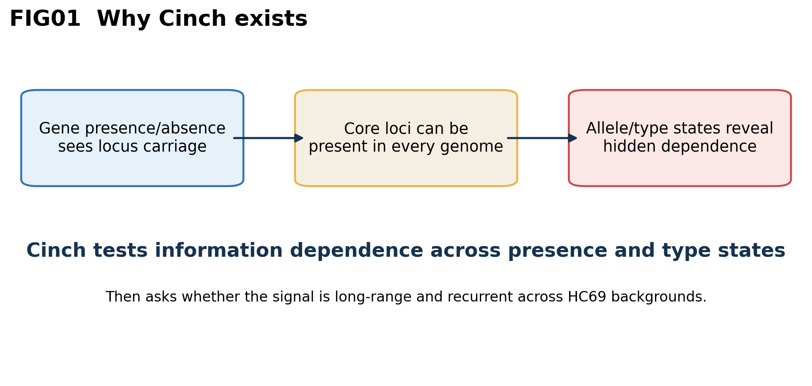

The current frozen development workflow separates three questions:

1. **Association:** how much information do two locus states share (MIraw/NMI)?
2. **Linkage:** is that information exceptional for the observed gene-order distance?
3. **Population recurrence:** does the same state-pair driver recur in at least two HC69 backgrounds, and how dispersed is its support (Neff)?

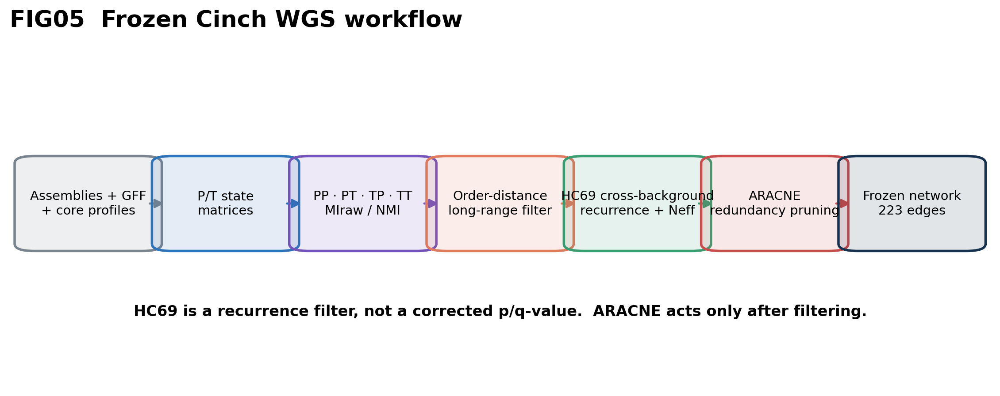

## The biological-state model

Allele IDs are nominal categories, never ordered integers, SNP counts or branch
lengths. MI is measured in **nats**. PT and TP are distinct computational
orientations — presence at A versus type at B, or type at A versus presence at B —
but are displayed together as P↔T when orientation is not the scientific question.

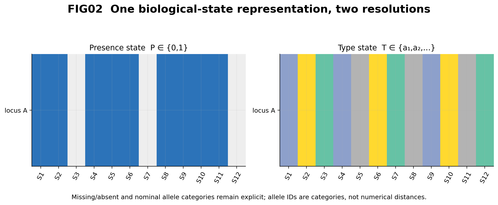

The state-pair contingency table also identifies the cells driving dependence.
Total MI quantifies dependence, while enriched/depleted cells say which biological
states carry it.

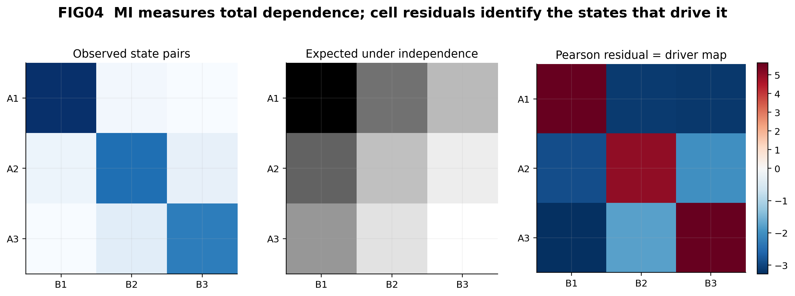

## SPN534: real-data development case

The worked example uses 534 *Streptococcus pneumoniae* genomes from the dataset
published with Coinfinder. It is a **development case**, not an unseen validation
cohort. The publication matrix/tree/outputs and versioned assembly/GFF provenance
are independently traceable under [`examples/spn534/provenance`](examples/spn534/provenance).

Frozen settings are **HC69** (a single-linkage allele-difference level, not 69
clusters) and **100 genes** for the long-range order threshold. This repository
reads the frozen scores; it does not recompute MI.

| stage | PP | PT | TP | TT |
|---|---:|---:|---:|---:|
| eligible | 2,902,845 | 1,180,977 | 2,109,466 | 67,853 |
| high information | 646 | 606 | 853 | 76 |
| order filtered | 309 | 303 | 448 | 42 |
| HC69 recurrent | 50 | 71 | 160 | 1 |
| Neff filtered | **4** | **58** | **160** | **1** |

The final frozen table has **223 oriented records / 223 unique unordered locus
pairs**. They are network-ready candidate dependencies. The checked-in freeze
stops before ARACNE; the network below is the full 223-edge candidate graph, not
an ARACNE-pruned significance set.


### Why gene-order distance?

Legacy diagnostics were reconstructed exactly for phylogenetic distance and from
the same provenance-verified GFF rules for order/bp distance. Of 3,955,078 locus
pairs, phylogenetic distance is available for 3,624,696 and both order and bp for
990,661. Order and bp availability is identical; among jointly mapped pairs their
Spearman correlation is 0.9973. Different-contig pairs remain **NA**, never an
invented large distance.

Order distance is retained because it is less sensitive to assembly-specific
intergenic expansion and is expressed in transferable gene units — not because
it has more observations than bp distance.

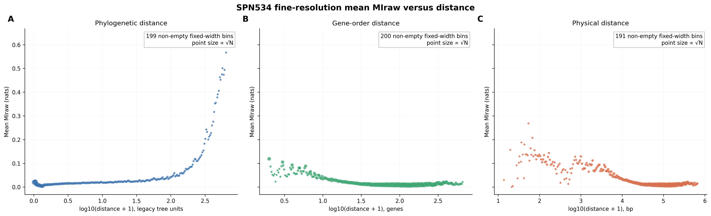

This fixed-width-bin view is the lead distance diagnostic: point area is
proportional to √N, so sparse tail bins remain visible without pretending they
carry the same support as dense bins. The density/availability audit below uses
all valid pairs and explains which pairs can contribute to each axis.

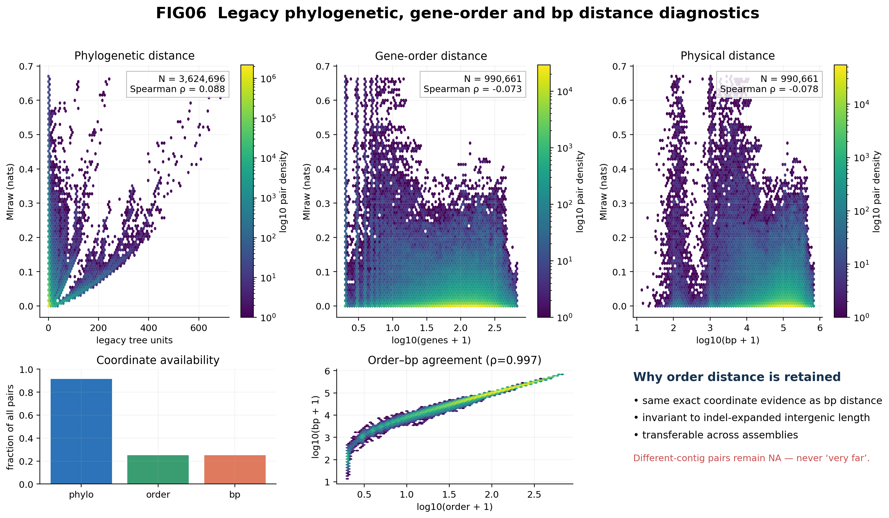

### Why HC69 recurrence and Neff?

HC69 is not a statistical correction that produces adjusted p/q-values. It asks
whether the **same driver** appears in multiple genetic backgrounds. For driver
support counts \(n_h\):

\[
p_h = \frac{n_h}{\sum_h n_h}, \qquad
N_{\mathrm{eff}} = \frac{1}{\sum_h p_h^2}.
\]

Neff is 1 when all support comes from one HC69 background and increases as support
is distributed. It is a recurrence-dispersion diagnostic, not the conventional
effective sample size of weighted observations.

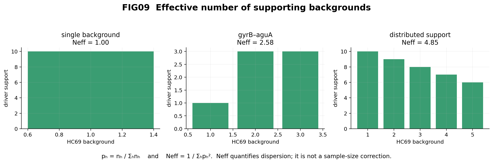

The contrast between `rsuA_2–glyS` and the frozen `gyrB–aguA` TT edge illustrates
why high TT MI alone is insufficient. The former's dominant driver is restricted
to one background (Neff=1); the latter repeats across three HC69 groups with
support 1:3:3 (Neff=2.58).

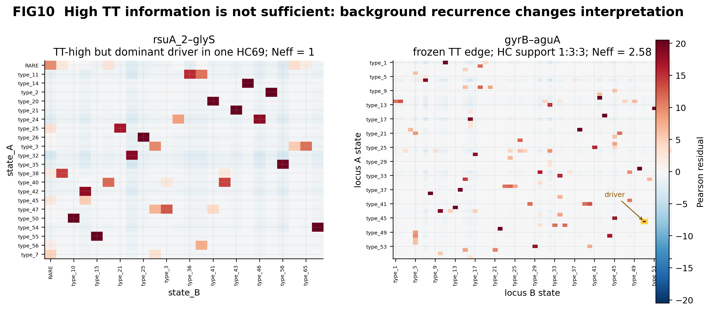

### What is new beyond presence/absence?

The PP-versus-TT plane makes the central contribution visible: points near PP
MI≈0 but with high TT MI are dependencies invisible to a P/A-only method.

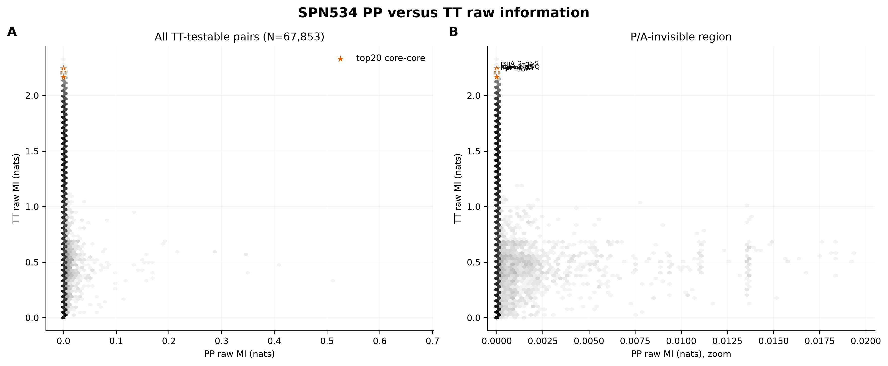

The tree-aligned state view shows the published core tree, HC69 memberships and
the exact P/T states for the four frozen PP edges and the one frozen TT edge.

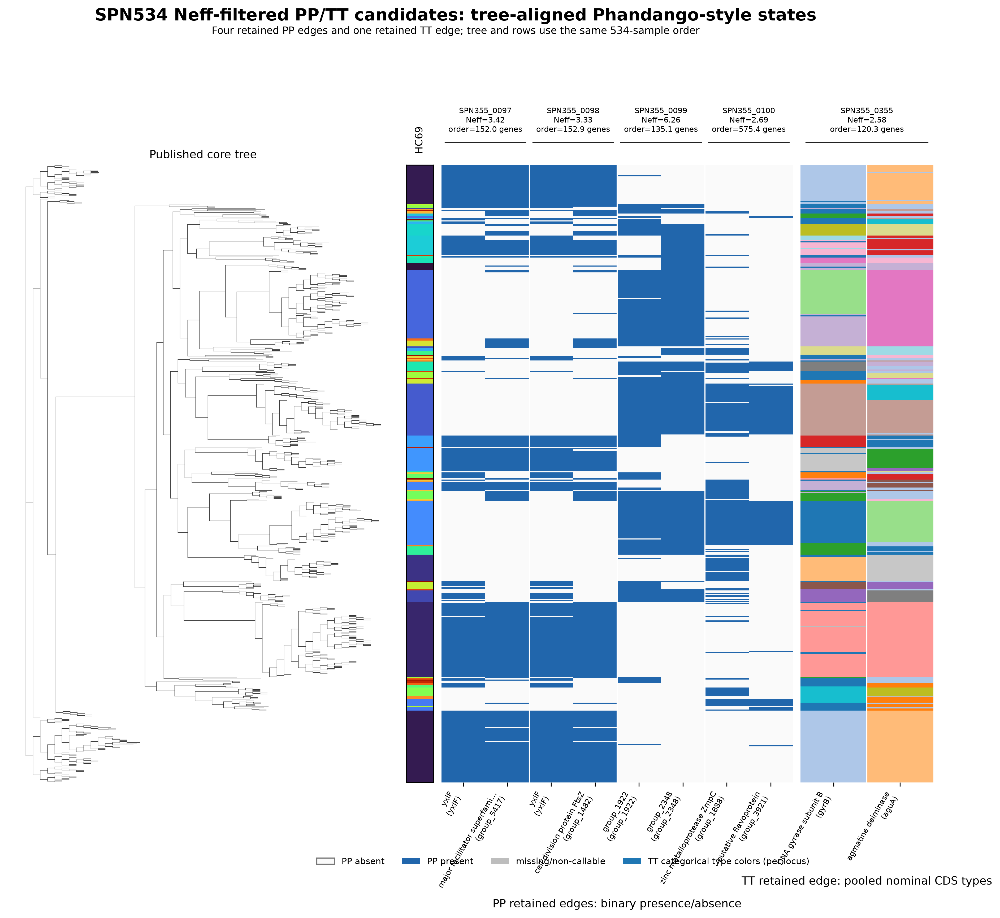

### External published comparator

Among 985 high-MI candidate pairs used for the comparator audit, 982 (99.70%) are
direct Coinfinder association/dissociation edges and 963 (97.77%) lie in the same
published component. This is strong **concordance with a published dependency
method**, not causal truth and not an unseen performance estimate. The V-ATPase
control demonstrates why dependency detection and local-linkage interpretation
must remain separate.

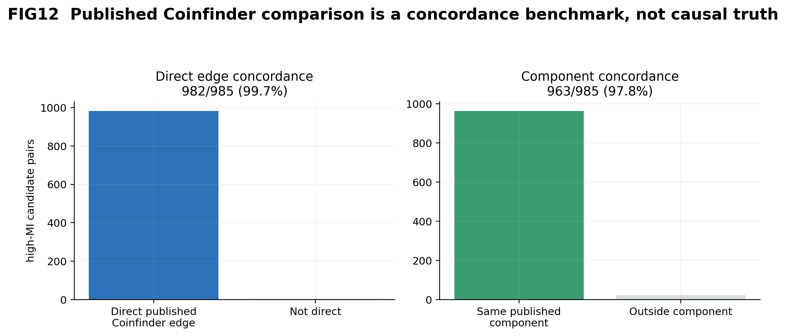

## Frozen network

The 223 candidates form a graph of 167 loci. Static communities are descriptive
graph partitions; they are not automatically pathways or mechanistic modules.

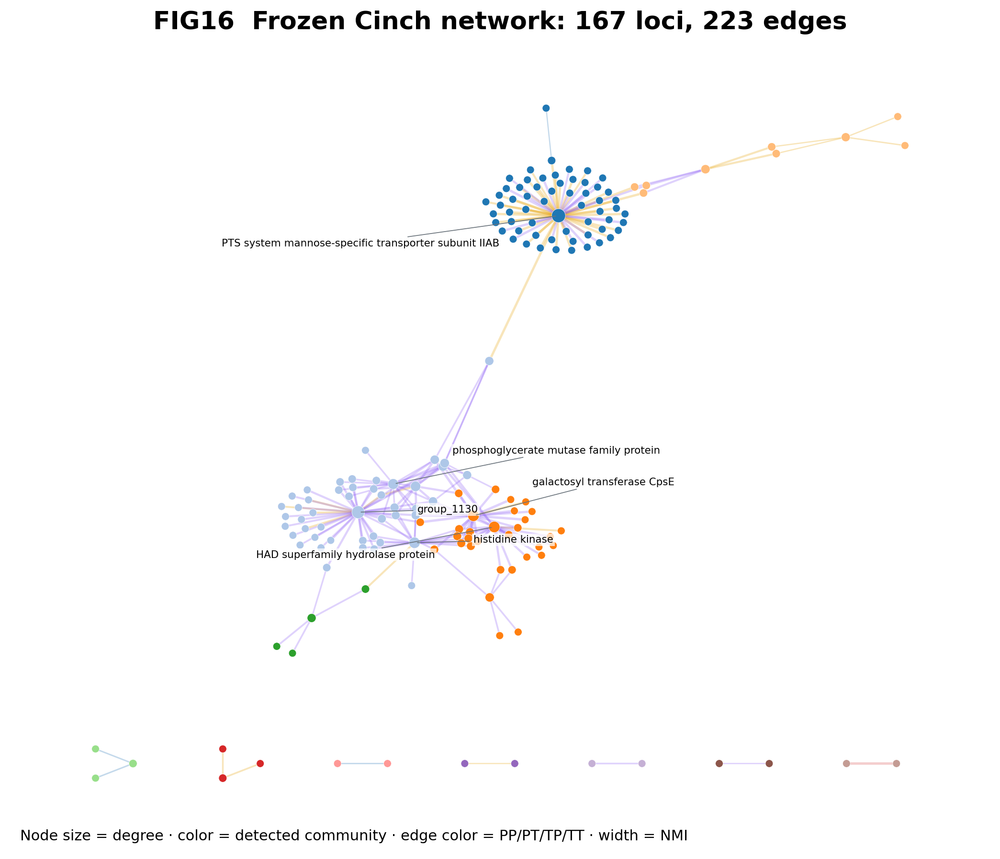

Open the **[interactive network](examples/spn534/network/CINCH_INTERACTIVE.html)**
to search loci/products, filter PP/PT/TP/TT, set MIraw/NMI/Neff/order/HC-support
thresholds, recolor edges, and inspect exact frozen metadata. GraphML and GEXF are
provided for Cytoscape, Gephi and other network software.

## Install and run the redistributable demo

```bash
git clone https://github.com/Naclist/Cinch.git
cd Cinch
python -m venv .venv
source .venv/bin/activate        # Windows: .venv\Scripts\activate
python -m pip install -e ".[test]"
pytest -q

cinch wgs \
  -r examples/tiny_wgs/input/ref.cds.fasta \
  -p tiny -t 4 \
  --phenotype examples/tiny_wgs/input/phenotype.tsv \
  examples/tiny_wgs/input/genomes/*.fasta

cinch filter --wgs_results tiny.cinch --hc 2 --order-threshold 2
```

The 48-genome toy includes PP/PT/TT positives plus local-linkage and
population-confounded negative controls. Expected outputs are committed under
[`examples/tiny_wgs/expected`](examples/tiny_wgs/expected).

## Repository map

| path | purpose |
|---|---|
| [`cinch/frozen_v1`](cinch/frozen_v1) | state construction, MI/NMI, hierarchy, order distance, recurrence and Neff |
| [`docs/SCIENTIFIC_NARRATIVE.md`](docs/SCIENTIFIC_NARRATIVE.md) | paper-style scientific walkthrough |
| [`docs/FIGURE_INDEX.md`](docs/FIGURE_INDEX.md) | FIG01–FIG17 with data provenance and interpretation |
| [`docs/DEVELOPMENT_HISTORY.md`](docs/DEVELOPMENT_HISTORY.md) | decisions, failures and frozen boundaries |
| [`examples/tiny_wgs`](examples/tiny_wgs) | fully redistributable end-to-end demo |
| [`examples/spn534`](examples/spn534) | frozen real-data tables, diagnostics, tree states, network and checksums |
| [`site`](site) | static GitHub Pages presentation |
| [`scripts/build_scientific_assets.py`](scripts/build_scientific_assets.py) | deterministic presentation build; never recomputes MI |
| [`FROZEN_CINCH_WGS_V1.yaml`](FROZEN_CINCH_WGS_V1.yaml) | machine-readable freeze contract |

## Interpretation boundaries

- MI/NMI measures dependence magnitude, not direction or causality.
- High PP may be co-occurrence or mutual exclusion; inspect the driver states.
- Cross-HC recurrence is not a population-adjusted significance test.
- Long-range order reduces obvious local linkage; it does not prove function.
- ARACNE is post-filter redundancy pruning and cannot define significance.
- SPN534 informed development and must not be presented as unseen validation.

Comparator inputs originate from
[fwhelan/coinfinder-manuscript](https://github.com/fwhelan/coinfinder-manuscript)
and Whelan, Rusilowicz & McInerney (2020),
[doi:10.1099/mgen.0.000338](https://doi.org/10.1099/mgen.0.000338).

## Status and license

The interface and scientific interpretation may change before a stable release.
No redistribution license has yet been selected; public source visibility is not
a grant of reuse rights. Please open an issue before production or publication use.
